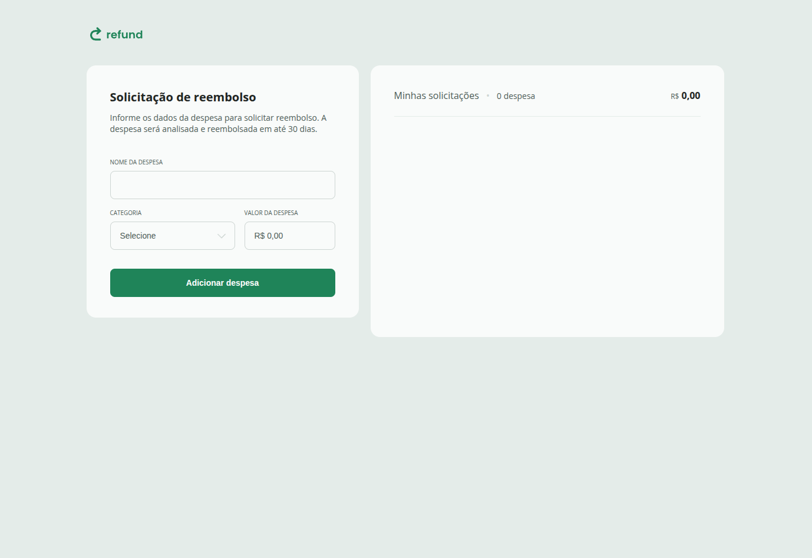

# Refund

Projeto desenvolvido durante o curso Full-Stack da Rocketseat. A aplicação simula uma tela de solicitação de reembolso, permitindo cadastrar despesas, listar os itens adicionados e acompanhar o valor total em tempo real.

## Preview

## Sobre o projeto

O Refund é uma interface web construída com HTML, CSS e JavaScript puro. O foco é praticar manipulação de DOM, formatação de valores em moeda brasileira e atualização dinâmica da interface a partir de eventos do usuário.

Além da implementação funcional, a identidade visual foi ajustada com uma nova paleta de cores, buscando tornar a interface mais autoral, moderna e alinhada ao meu estilo de apresentação.

## Destaques do projeto

- Interface limpa e objetiva para controle de solicitações de reembolso
- Formulário com validação básica para cadastro de despesas
- Lista dinâmica com inclusão e remoção de itens
- Cálculo automático do total e da quantidade de despesas
- Formatação de moeda no padrão brasileiro em tempo real

## Funcionalidades

- Cadastro de despesas com nome, categoria e valor
- Formatação automática do valor no padrão brasileiro
- Listagem dinâmica das despesas adicionadas
- Cálculo automático da quantidade de itens e do total
- Remoção de despesas da lista

## Tecnologias utilizadas

- HTML5
- CSS3
- JavaScript

## Estrutura do projeto

- index.html: estrutura principal da página
- styles.css: estilos e layout da interface
- sripits.js: lógica de interação, validação e atualização da lista
- img/: ícones e assets utilizados na interface

## Como executar

Como este projeto é estático, não há necessidade de instalar dependências.

1. Faça o download ou clone do repositório
2. Abra o arquivo index.html no navegador

Se preferir, você também pode abrir a pasta diretamente no VS Code e usar a extensão Live Server para visualizar o projeto.

## Aprendizados

Este projeto ajudou a consolidar conceitos importantes do JavaScript e do desenvolvimento web, como:

- manipulação de elementos do DOM
- tratamento de eventos de formulário
- criação dinâmica de elementos na interface
- controle de estado da lista de despesas
- formatação de moeda com toLocaleString
- organização da lógica em funções reutilizáveis
- uso de dataset e atributos dinâmicos para renderização dos itens
- atualização da interface com base nas interações do usuário

Além disso, foi uma boa prática para entender como pequenas aplicações front-end podem sair de um formulário simples para uma experiência visual mais completa e funcional.

## Autor

Projeto baseado em uma aula da Rocketseat, adaptado para prática e consolidação dos fundamentos de Front-End.

Professor/instrutor do conteúdo original: [@orodrigogo](https://github.com/orodrigogo)
